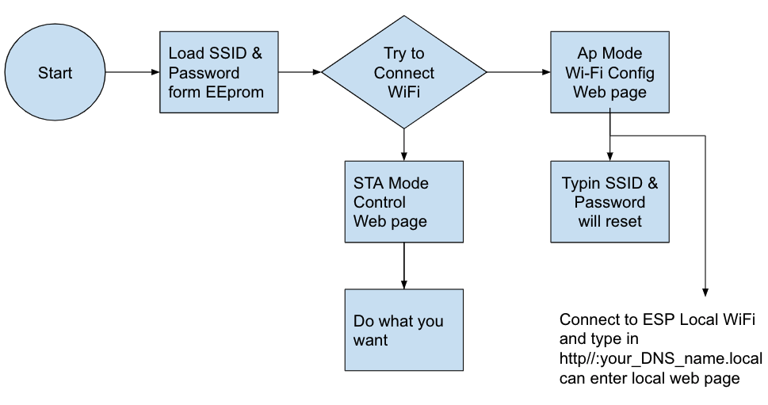
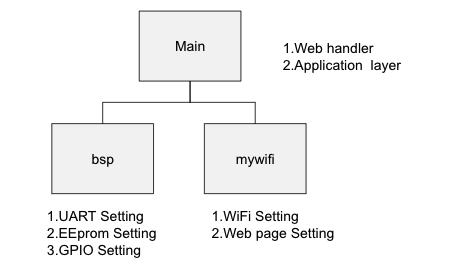

# Tutorials

## Flow char



## Project Structure



## Local Web page


## Control Web page


### Parameter Setting in myWifi.c

```cpp
const char* local_ssid="your_LocalAP_SSID";
const char* mDNS_name="yours_DNS_name";

```


